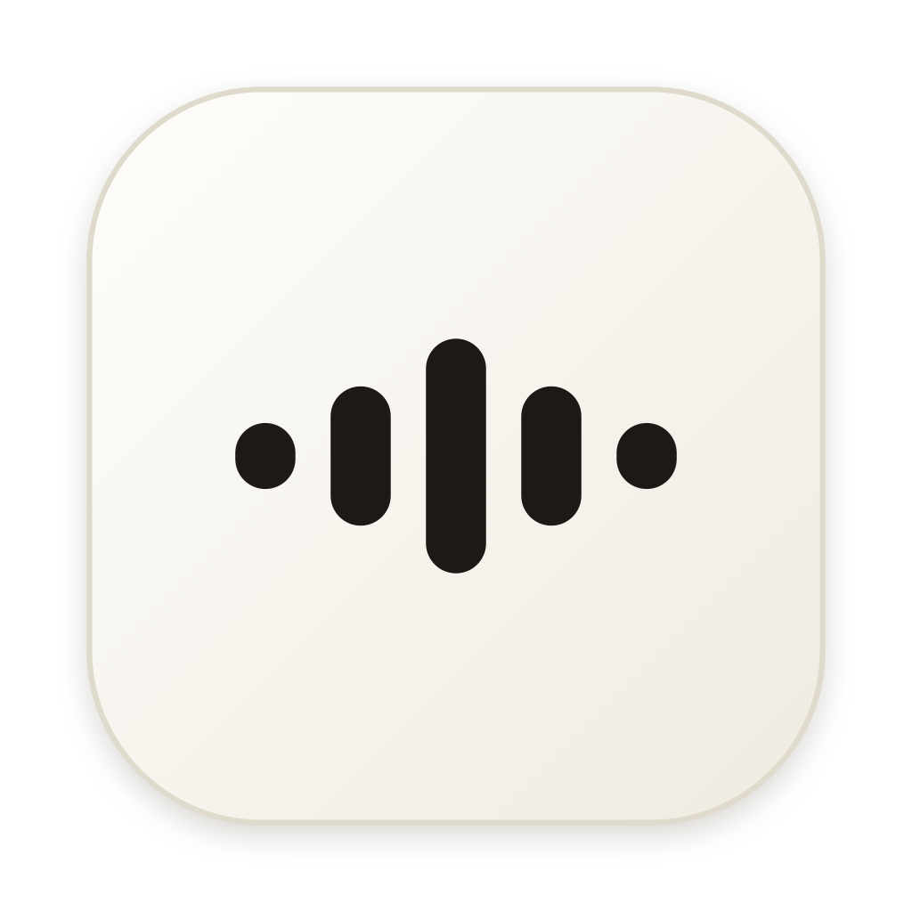

# Sono

Dictation for macOS that runs entirely on your Mac. Hold a key, speak, and the
text appears in whatever app you're using. No audio or transcript ever leaves
the device.

Free, MIT licensed, and there is nothing to buy: no account, no licence key, no
trial.



## How it works

```
mic → AVAudioEngine (16 kHz mono)
    → Parakeet TDT 0.6B v3 int8, via sherpa-onnx / ONNX Runtime
    → Apple Intelligence (Foundation Models): self-corrections, grammar, lists
    → regex sweep for fillers the model missed
    → clipboard + synthetic ⌘V into the focused field
    → appended to history.jsonl
```

Two deliberate properties:

- **Your speech is never networked.** Sono makes exactly two kinds of HTTP
  request, and neither carries audio or text: the one-time model download on
  first launch, and Sparkle's daily check for a new version, which sends only a
  version number and can be turned off in Settings.
- **The language model is never trusted.** `Polisher` rejects its output if it is
  empty, doubles in length (it answered instead of editing), halves in length (it
  ate a clause), or opens with a refusal. Any rejection pastes the raw transcript
  instead, so a bad model day costs polish, never words.

## Building

Requires Xcode 26+ and macOS 26+.

```bash
Scripts/fetch-sherpa.sh    # 103 MB of sherpa-onnx libs, not in git
xcodegen generate          # .xcodeproj is generated from project.yml
xcodebuild -project Sono.xcodeproj -scheme Sono -configuration Debug build
```

Then launch the built `.app` directly:

```bash
open ~/Library/Developer/Xcode/DerivedData/Sono-*/Build/Products/Debug/Sono.app
```

**Do not use Xcode's ▶ Run button.** Sono's UI is a floating `NSPanel`; when the
debugger pauses the process the island freezes, permission dialogs are orphaned,
and the process resists `SIGKILL` until its `debugserver` parent is killed.

## Layout

| File | Role |
|---|---|
| `SonoApp.swift` | app entry, and the record → transcribe → polish → paste loop |
| `Island.swift` | the floating pill (non-activating panel) and the brand mark |
| `Recorder.swift` | mic capture, resampled to 16 kHz mono |
| `ParakeetTranscriber.swift` | sherpa-onnx recognizer, chunked at silent points |
| `Polisher.swift` | Apple Intelligence cleanup, with output guards |
| `Cleanup.swift` | regex fillers and stutters; preserves list formatting |
| `Injector.swift` | clipboard + synthetic ⌘V, clipboard restored after |
| `ModelDownloader.swift` | first-run model fetch, checksum-verified |
| `DashboardView.swift` | dashboard, history and settings; palette and theming |
| `Metrics.swift` | all dashboard figures, derived from history |
| `Hotkey.swift` | ⌥ tap to toggle, ⌥ hold for push-to-talk |

## Things that cost a day to learn

- Hardened Runtime **silently denies the microphone with no dialog** unless
  `com.apple.security.device.audio-input` is in the entitlements.
- A bare F9 never reaches an app when "Use F1, F2… as standard function keys" is
  off, because macOS delivers it as a media key. Hence the ⌥ modifier trigger.
- A SwiftUI `.shadow()` on the island gets clipped by the panel bounds when the
  pill grows, drawing a hard rectangle. Depth comes from the window shadow only.
- `Cleanup` must only touch horizontal whitespace, or it flattens the lists the
  polish layer produces.

## Licence

Sono is MIT licensed; see `LICENSE`.

It stands on work by others, all of it attribution-only and none of it copyleft:

- NVIDIA Parakeet TDT 0.6B v3, CC BY 4.0. Quantised to int8 here and mirrored at
  [aeyar-studio/sono-models](https://github.com/aeyar-studio/sono-models).
- [sherpa-onnx](https://github.com/k2-fsa/sherpa-onnx), Apache 2.0, with ONNX
  Runtime under MIT.
- [Sparkle](https://github.com/sparkle-project/Sparkle), MIT.
- Plus Jakarta Sans and Fraunces, SIL OFL 1.1.

Full attributions, including the statement of modification the model's licence
requires, are in `NOTICE.md`.
